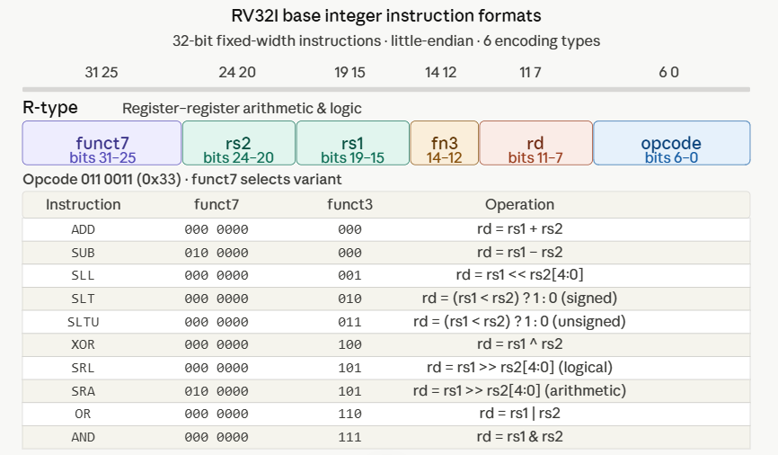
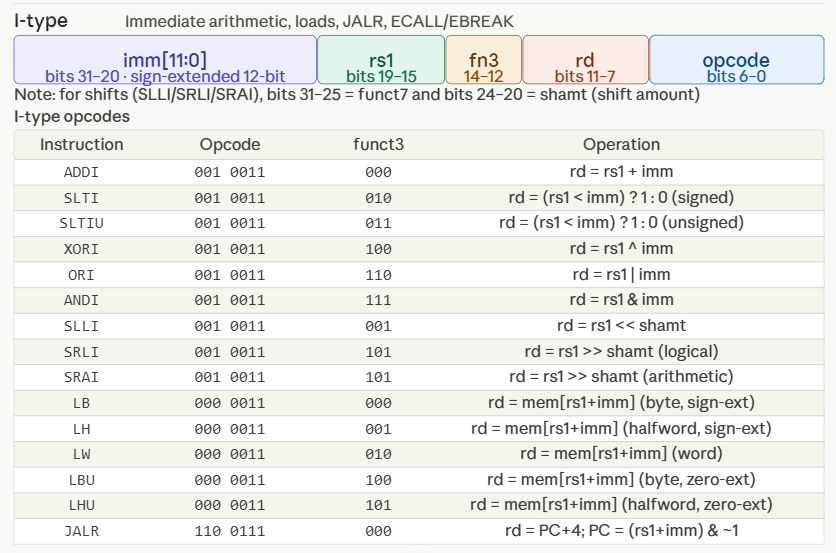
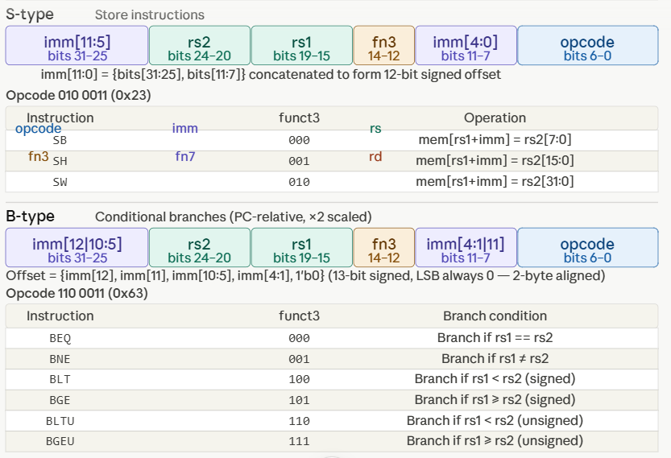
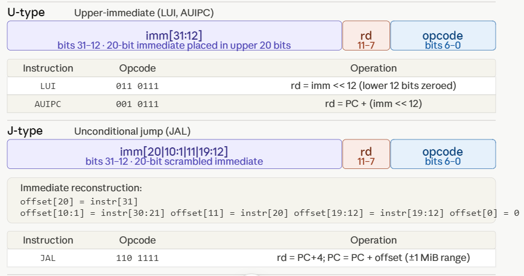
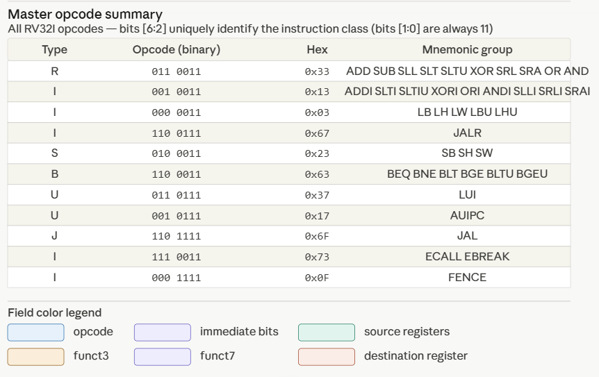

# RV32I Opcode Decoder

## Overview

This module implements an opcode decoder for the RV32I Base Integer Instruction Set Architecture (ISA) of RISC-V. The decoder examines the 7-bit opcode field of a 32-bit instruction and identifies the instruction format. The decoded outputs can later be used by the control unit to generate the appropriate control signals for the processor datapath.

---

## RV32I Instruction Formats

RISC-V RV32I supports six major instruction formats:

| Format | Purpose                                                |
| ------ | ------------------------------------------------------ |
| R-Type | Register-to-register arithmetic and logical operations |
| I-Type | Immediate arithmetic, loads, and JALR                  |
| S-Type | Store instructions                                     |
| B-Type | Branch instructions                                    |
| U-Type | Upper immediate instructions                           |
| J-Type | Jump instructions                                      |

---

## R-Type Instruction Format

Used for register-to-register ALU operations such as ADD, SUB, AND, OR, XOR, SLL, SRL, SRA, and SLT.

```text
31          25 24   20 19   15 14  12 11    7 6      0
+-------------+-------+-------+------+-------+--------+
|  funct7     | rs2   | rs1   |funct3|  rd   | opcode |
+-------------+-------+-------+------+-------+--------+
     7 bits     5 bits  5 bits 3 bits  5 bits  7 bits
```

---

## I-Type Instruction Format

Used for immediate arithmetic instructions, loads, and JALR.

```text
31                     20 19   15 14  12 11    7 6      0
+------------------------+-------+------+-------+--------+
|      imm[11:0]         | rs1   |funct3|  rd   | opcode |
+------------------------+-------+------+-------+--------+
```

---

## S-Type Instruction Format

Used for store instructions.

```text
31        25 24   20 19   15 14  12 11       7 6      0
+-----------+-------+-------+------+-----------+--------+
| imm[11:5] | rs2   | rs1   |funct3| imm[4:0] | opcode |
+-----------+-------+-------+------+-----------+--------+
```

---

## B-Type Instruction Format

Used for conditional branch instructions.

```text
31      25 24   20 19   15 14  12 11       7 6      0
+----------+-------+-------+------+-----------+--------+
| immediate| rs2   | rs1   |funct3| immediate | opcode |
+----------+-------+-------+------+-----------+--------+
```

---

## U-Type Instruction Format

Used by LUI and AUIPC instructions.

```text
31                         12 11    7 6      0
+----------------------------+-------+--------+
|         imm[31:12]         |  rd   | opcode |
+----------------------------+-------+--------+
```

---

## J-Type Instruction Format

Used by JAL instructions.

```text
31                         12 11    7 6      0
+----------------------------+-------+--------+
|          immediate         |  rd   | opcode |
+----------------------------+-------+--------+
```

---

## Register Fields

RV32I contains 32 general-purpose registers:

```text
x0, x1, x2, ... , x31
```

Since 32 registers must be addressed:

```text
log2(32) = 5 bits
```

Therefore:

| Field | Width  |
| ----- | ------ |
| rs1   | 5 bits |
| rs2   | 5 bits |
| rd    | 5 bits |

---

## Opcode, funct3, and funct7

### Opcode (7 bits)

The opcode identifies the instruction format and major instruction class.

### funct3 (3 bits)

The funct3 field identifies the arithmetic or logical operation category.

### funct7 (7 bits)

The funct7 field is used when funct3 alone is insufficient to uniquely identify an instruction.

Example:

| Instruction | Opcode  | funct3 | funct7  |
| ----------- | ------- | ------ | ------- |
| ADD         | 0110011 | 000    | 0000000 |
| SUB         | 0110011 | 000    | 0100000 |

Both ADD and SUB share the same opcode and funct3 values, so funct7 is required to distinguish them.

---

## Common RV32I R-Type Instructions

| Instruction | Opcode  | funct3 | funct7  |
| ----------- | ------- | ------ | ------- |
| ADD         | 0110011 | 000    | 0000000 |
| SUB         | 0110011 | 000    | 0100000 |
| AND         | 0110011 | 111    | 0000000 |
| OR          | 0110011 | 110    | 0000000 |
| XOR         | 0110011 | 100    | 0000000 |
| SLL         | 0110011 | 001    | 0000000 |
| SRL         | 0110011 | 101    | 0000000 |
| SRA         | 0110011 | 101    | 0100000 |
| SLT         | 0110011 | 010    | 0000000 |

---

## Decoder Functionality

The opcode decoder examines the 7-bit opcode field and classifies the instruction into one of the supported RV32I instruction formats:

* R-Type
* I-Type
* S-Type
* B-Type
* U-Type
* J-Type

The decoder output can be connected to a control unit, which subsequently generates the control signals required for instruction execution.

---

## Conclusion

This opcode decoder forms the first stage of the instruction decode process in a RISC-V processor. By identifying the instruction format from the opcode field, it enables subsequent modules such as the control unit, register file, ALU, branch unit, and memory interface to correctly interpret and execute RV32I instructions.

## Explanatory diagrams












