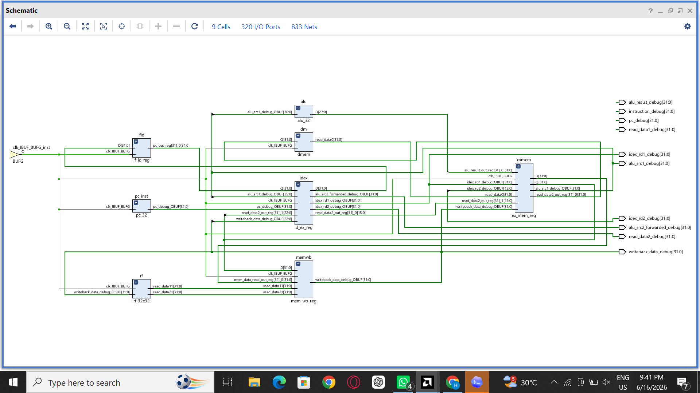
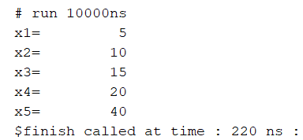
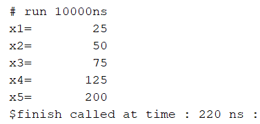
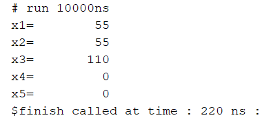
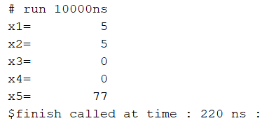
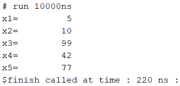
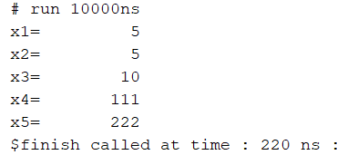

# RV32I 5-Stage Pipelined Processor (Verilog)

## Overview

This project implements a simplified **RV32I 5-stage pipelined processor** in Verilog.

The processor supports:

* Instruction Fetch (IF)
* Instruction Decode (ID)
* Execute (EX)
* Memory Access (MEM)
* Write Back (WB)

### Implemented Features

* R-Type Instructions

  * ADD
  * SUB
  
* I-Type Instructions

  * ADDI
  * LW
* S-Type Instructions

  * SW
* B-Type Instructions

  * BEQ
* Data Forwarding Unit
* Load-Use Hazard Detection Unit
* Pipeline Stall Logic
* Branch Flush Logic

---

# Pipeline Structure

```
IF -> ID -> EX -> MEM -> WB
```

Additional units:

* Forwarding Unit
* Hazard Detection Unit
* Register File
* Instruction Memory
* Data Memory

---

# RTL Schematic

The following RTL schematic was generated using Vivado's Elaborated Design view. It shows the major datapath modules used in the implementation, including the Program Counter, Register File, Pipeline Registers, ALU, and Data Memory.



# Test Cases and Verification

## Test 1: Basic ADDI and ADD Instructions

### Assembly Program

```assembly
addi x1,x0,5
addi x2,x0,10
add  x3,x1,x2
add  x4,x3,x1
add  x5,x4,x4
nop
```

### Machine Code

```text
00500093
00A00113
002081B3
00118233
004202B3
00000013
```

### Expected Output

```text
x1 = 5
x2 = 10
x3 = 15
x4 = 20
x5 = 40
```

### Console Output Screenshot



### Status

✅ PASS

---

# Test 2: Load Instruction and Load-Use Hazard

Data Memory Initialization:

```verilog
mem[0] = 25;
```

### Assembly Program

```assembly
lw   x1,0(x0)
add  x2,x1,x1
add  x3,x2,x1
add  x4,x3,x2
add  x5,x4,x3
```

### Machine Code

```text
00002083
00108133
001101B3
00218233
003202B3
00000013
```

### Expected Output

```text
x1 = 25
x2 = 50
x3 = 75
x4 = 125
x5 = 200
```

### Console Output Screenshot



### Verification

This test verifies:

* LW operation
* Load-use hazard detection
* Pipeline stall insertion
* Forwarding after load
* Register writeback from memory

### Status

✅ PASS

# Test 3: Store Instruction Verification

### Assembly Program

```assembly
addi x1,x0,55
sw   x1,0(x0)
lw   x2,0(x0)
add  x3,x2,x1
nop
```

### Machine Code

```text
03700093
00102023
00002103
001101B3
00000013
```

### Expected Output

```text
x1 = 55
x2 = 55
x3 = 110
```
### Console Output Screenshot



### Verification

This test verifies:

* SW operation
* Memory write path
* LW operation
* Memory read path
* Memory writeback

### Status

✅ PASS

# Test 4: Branch Taken

### Assembly Program

```assembly
addi x1,x0,5
addi x2,x0,5
beq  x1,x2,label
addi x3,x0,99
addi x4,x0,42

label:
addi x5,x0,77
```

### Machine Code

```text
00500093
00500113
00208663
06300193
02A00213
04D00293
00000013
```

### Expected Output

```text
x1 = 5
x2 = 5
x3 = 0
x4 = 0
x5 = 77
```
### Console Output Screenshot



### Verification

This test verifies:

* BEQ operation
* Branch target calculation
* Pipeline flush logic
* Control hazard handling

### Status

✅ PASS

# Test 5: Branch Not Taken

### Assembly Program

```assembly
addi x1,x0,5
addi x2,x0,10
beq  x1,x2,label
addi x3,x0,99
addi x4,x0,42

label:
addi x5,x0,77
```

### Machine Code

```text
00500093
00A00113
00208663
06300193
02A00213
04D00293
00000013
```

### Expected Output

```text
x1 = 5
x2 = 10
x3 = 99
x4 = 42
x5 = 77
```

### Console Output Screenshot



### Verification

This test verifies:

* BEQ comparison logic
* Correct execution of fall-through path
* Control flow correctness

### Status

✅ PASS


# Test 6: Branch Using Latest Computed Value

### Assembly Program

```assembly
addi x1,x0,5
addi x2,x0,5
add  x3,x1,x2
beq  x3,x2,label
addi x4,x0,111

label:
addi x5,x0,222
```

### Machine Code

```text
00500093
00500113
002081B3
00218463
06F00213
0DE00293
00000013
```

### Expected Output

```text
x1 = 5
x2 = 5
x3 = 10
x4 = 111
x5 = 222
```
### Console Output Screenshot



### Verification

This test verifies:

* Branch decision using freshly computed ALU result
* Forwarding into branch comparison logic
* Correct control hazard handling

### Status

✅ PASS


# Features Successfully Verified

| Feature               | Status |
| --------------------- | ------ |
| ADD                   | ✅      |
| ADDI                  | ✅      |
| LW                    | ✅      |
| SW                    | ✅      |
| BEQ                   | ✅      |
| Register File         | ✅      |
| Forwarding Unit       | ✅      |
| Hazard Detection Unit | ✅      |
| Load-Use Stall        | ✅      |
| Branch Flush          | ✅      |
| Memory Read           | ✅      |
| Memory Write          | ✅      |
| Write Back            | ✅      |

---

# Conclusion

This project successfully implements a 5-stage pipelined RV32I processor in Verilog, featuring Instruction Fetch (IF), Instruction Decode (ID), Execute (EX), Memory Access (MEM), and Write Back (WB) stages.

Through extensive simulation and verification, the processor was validated for:

* R-Type instructions (ADD)
* I-Type instructions (ADDI, LW)
* S-Type instructions (SW)
* B-Type instructions (BEQ)
* Data Forwarding
* Load-Use Hazard Detection
* Pipeline Stall Insertion
* Branch Handling and Pipeline Flush Mechanisms

Multiple test programs were executed to verify arithmetic operations, memory access operations, data hazards, load-use hazards, forwarding paths, branch decisions, and control hazard handling. All simulation results matched the expected outputs, confirming the correctness of the pipeline datapath and control logic.

This project provided practical experience in computer architecture concepts such as pipelining, hazard management, forwarding, stalling, branch control, and RV32I instruction execution, forming a strong foundation for implementing a complete RISC-V processor in future work.

