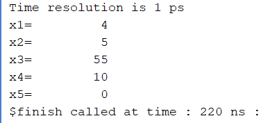

# RV32I 5-Stage Pipelined RISC-V Processor

## Overview

This project implements a 32-bit RISC-V (RV32I) processor with a classic 5-stage pipeline architecture in Verilog HDL. The processor supports arithmetic, logical, memory access, control flow, and system instructions while incorporating hazard detection, forwarding, pipeline flushing, and basic performance measurement features.

The design was developed and verified using Xilinx Vivado and follows the standard RISC-V pipeline organization:

```text
IF  →  ID  →  EX  →  MEM  →  WB
```

---

# Features Implemented

## RV32I Instruction Support

### R-Type Instructions

| Instruction | Description |
|------------|-------------|
| ADD | Addition |
| SUB | Subtraction |
| AND | Bitwise AND |
| OR | Bitwise OR |
| XOR | Bitwise XOR |
| SLT | Set Less Than |
| SLL | Logical Left Shift |
| SRL | Logical Right Shift |
| SRA | Arithmetic Right Shift |

---

### I-Type Instructions

| Instruction | Description |
|------------|-------------|
| ADDI | Add Immediate |
| ORI | OR Immediate |
| SLTI | Set Less Than Immediate |

---

### Memory Instructions

| Instruction | Description |
|------------|-------------|
| LW | Load Word |
| SW | Store Word |

---

### Control Flow Instructions

| Instruction | Description |
|------------|-------------|
| BEQ | Branch if Equal |
| JAL | Jump and Link |

---

### System Instruction

| Instruction | Description |
|------------|-------------|
| ECALL | Program Halt |

---

### Upper Immediate Instructions

| Instruction | Description |
|------------|-------------|
| LUI | Load Upper Immediate |
| AUIPC | Add Upper Immediate to PC |

---

### Multiplication Support

| Instruction | Description |
|------------|-------------|
| MUL | Integer Multiplication |

---

# Processor Architecture

The processor follows a standard 5-stage pipeline architecture.

---

## Stage 1 : Instruction Fetch (IF)

Responsibilities:

- Fetch instruction from instruction memory.
- Supply instruction to IF/ID pipeline register.
- Increment Program Counter.

Operation:

```text
Instruction = IMEM[PC]
PC = PC + 4
```

Outputs:

```text
Instruction
PC
```

---

## Stage 2 : Instruction Decode (ID)

Responsibilities:

- Decode instruction fields.
- Read source operands from register file.
- Generate control signals.
- Generate immediate values.
- Detect hazards.

Modules involved:

```text
Register File
Control Unit
Immediate Generator
Hazard Detection Unit
```

Outputs:

```text
Read Data 1
Read Data 2
Immediate
Control Signals
```

---

## Stage 3 : Execute (EX)

Responsibilities:

- ALU operations
- Branch comparison
- Forwarding logic
- Jump target generation
- Address calculation

Modules involved:

```text
ALU
Forwarding Unit
Branch Logic
```

Outputs:

```text
ALU Result
Branch Decision
Jump Target
```

---

## Stage 4 : Memory Access (MEM)

Responsibilities:

- Load Word operations
- Store Word operations

Modules involved:

```text
Data Memory
```

Outputs:

```text
Memory Data
```

---

## Stage 5 : Write Back (WB)

Responsibilities:

- Write results back to register file.

Sources:

```text
ALU Result
Memory Data
PC + 4 (JAL)
```

---

# Pipeline Registers

The processor contains four pipeline registers.

---

## IF/ID Register

Stores:

```text
Instruction
PC
```

---

## ID/EX Register

Stores:

```text
Read Data 1
Read Data 2
Immediate
Destination Register
Control Signals
PC
```

---

## EX/MEM Register

Stores:

```text
ALU Result
Store Data
Destination Register
Control Signals
PC+4 (for JAL)
```

---

## MEM/WB Register

Stores:

```text
ALU Result
Memory Data
Destination Register
Control Signals
PC+4 (for JAL)
```

---

# Hazard Handling

## Data Hazard Detection

The processor detects Load-Use hazards.

Condition:

```verilog
stall = ex_memread &&
       ((ex_rd == id_rs1 && ex_rd != 0) ||
        (ex_rd == id_rs2 && ex_rd != 0));
```

Action:

```text
Freeze PC
Freeze IF/ID Register
Insert Bubble into Pipeline
```

---

## Forwarding Unit

The forwarding unit eliminates unnecessary stalls.

Forwarding Sources:

```text
EX/MEM Stage
MEM/WB Stage
```

Forwarding Controls:

```text
forwardA
forwardB
```

Possible values:

```text
00 → Normal Register Read
01 → MEM/WB Forwarding
10 → EX/MEM Forwarding
```

---

# Branch Handling

Supported Instruction:

```text
BEQ
```

Branch decision:

```text
if(rs1 == rs2)
    branch_taken = 1
```

Pipeline action:

```text
Flush incorrect instruction
Update PC with branch target
```

---

# JAL Implementation

## Operation

```assembly
jal rd, offset
```

Performs:

```text
rd = PC + 4
PC = PC + offset
```

---

## Pipeline Implementation

### Jump Target

Generated in EX stage:

```text
Jump Target = PC + Immediate
```

---

### Return Address

Generated in EX stage:

```text
PC + 4
```

---

### Pipeline Propagation

The return address travels through:

```text
EX
 ↓
EX/MEM
 ↓
MEM/WB
 ↓
WB
```

using:

```text
pc_plus4_ex
exmem_pc_plus4
memwb_pc_plus4
```

---

### Writeback Selection

```text
if(JAL)
    wb_data = PC + 4
else if(LW)
    wb_data = Memory Data
else
    wb_data = ALU Result
```

---

# ECALL Support

Purpose:

```text
Program termination.
```

Detection:

```text
Opcode = 1110011
```

Behavior:

```text
halt <= 1
```

Processor stops fetching new instructions after ECALL execution.

---

# LUI Implementation

Operation:

```assembly
lui rd, imm20
```

Example:

```assembly
lui x1, 0x12345
```

Result:

```text
x1 = 0x12345000
```

Implementation:

```text
Upper 20 bits loaded
Lower 12 bits filled with zeros
```

---

# AUIPC Implementation

Operation:

```assembly
auipc rd, imm20
```

Example:

```assembly
auipc x2, 0x10
```

Result:

```text
x2 = PC + 0x10000
```

Implementation:

```text
rd = PC + (imm << 12)
```

---

# MUL Implementation

Operation:

```assembly
mul rd, rs1, rs2
```

Example:

```assembly
mul x3, x1, x2
```

Result:

```text
x3 = x1 × x2
```

Implemented as:

```verilog
result = operand1 * operand2;
```

---

# Performance Counters

The processor includes:

## Cycle Counter

Tracks total clock cycles executed.

```verilog
cycle_count <= cycle_count + 1;
```

---

## Instruction Counter

Tracks retired instructions.

```verilog
instruction_count <= instruction_count + 1;
```

---

# Verification Results

The processor was verified using multiple simulation programs covering:

- Arithmetic Instructions
- Immediate Instructions
- Load/Store Operations
- Branch Operations
- Hazard Detection
- Forwarding Logic
- ECALL Execution
- LUI
- AUIPC
- MUL
- JAL

---

## Example JAL Verification

Program:

```assembly
jal x1, 8

addi x2, x0, 111

addi x3, x0, 55
```

Expected:

```text
x1 = 4
x2 = unchanged / skipped
x3 = 55
```

Simulation Output:



This confirms:

```text
✓ Correct Jump Target
✓ Correct Pipeline Flush
✓ Correct Return Address Storage
✓ Correct Writeback of PC+4
```

---

# Tools Used

- Verilog HDL
- Xilinx Vivado
- Artix-7 FPGA Target
- Behavioral Simulation
- RTL Analysis

---

# Future Improvements

- JALR Support
- Complete RV32I ISA
- Branch Prediction
- Multi-cycle Multiplier
- Instruction Cache
- Data Cache
- Cache Miss Penalty Handling
- CSR Instructions
- Exception Handling

---

# Author

Himani Goel  
B.Tech Integrated Circuit Design and Technology (ICDT)  
Indian Institute of Technology Gandhinagar (IITGN)
