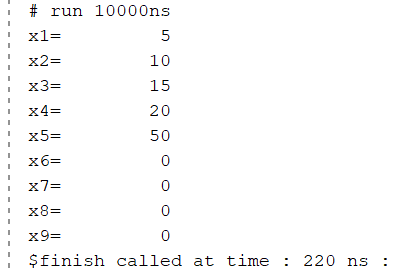

# Running a RISC-V Array Sum Program from Memory

## Objective

To verify correct execution of a memory-based RISC-V program by loading array elements from data memory and computing their sum using the RV32I 5-stage pipelined processor.

---

## Array Initialization

The data memory was initialized with:

```text
mem[0] = 5
mem[1] = 10
mem[2] = 15
mem[3] = 20
```

Array:

```text
[5, 10, 15, 20]
```

Expected Sum:

```text
5 + 10 + 15 + 20 = 50
```

---

## Assembly Program

```assembly
addi x10, x0, 0

lw x1, 0(x10)
lw x2, 1(x10)
lw x3, 2(x10)
lw x4, 3(x10)

add x5, x1, x2
add x5, x5, x3
add x5, x5, x4

ecall
```

---

## Machine Code

```text
00000513
00052083
00152103
00252183
00352203
002082B3
003282B3
004282B3
00000073
```

---

## Simulation Output



---

## Verification

The values were successfully loaded from data memory using LW instructions and accumulated using ADD instructions.

Final result:

```text
x5 = 50
```

matches the expected array sum:

```text
5 + 10 + 15 + 20 = 50
```

This verifies correct operation of instruction fetch, decode, load-word execution, ALU arithmetic, register writeback, and complete program execution from memory.
