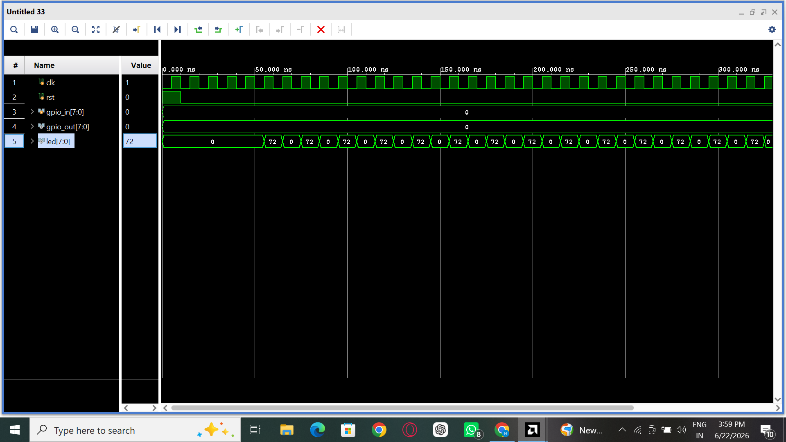

# Interface GPIO-Like Output to Simulate Blinking LEDs

## Objective

To interface a GPIO (General Purpose Input/Output) module with the RV32I 5-stage pipelined processor and simulate blinking LEDs using processor-generated output data.

---

## Introduction

GPIO is a simple digital interface used by processors to communicate with external peripherals such as LEDs, switches, sensors, and displays.

In this experiment, the output generated by the RISC-V processor is connected to a GPIO module. The GPIO module drives an LED output signal which is observed during simulation.

To simulate LED blinking, a toggle flip-flop is used inside the GPIO module. The LED output alternates between the processor-generated value and zero, creating an ON/OFF blinking effect.

---

## GPIO Module

The GPIO module receives an 8-bit data value from the processor and drives the LED output.

```verilog id="gpio_code"
module gpio(
    input clk,
    input rst,
    input [7:0] data,
    output reg [7:0] led
);

    reg toggle;

    always @(posedge clk or posedge rst) begin
        if(rst)
            toggle <= 1'b0;
        else
            toggle <= ~toggle;
    end

    always @(*) begin
        if(toggle)
            led = data;
        else
            led = 8'b0;
    end

endmodule
```

---

## Processor Program

The following RISC-V program was executed:

```assembly id="asm_gpio"
addi x5, x0, 72
ecall
```

Machine Code:

```text id="machine_gpio"
04800293
00000073
```

The processor stores the decimal value 72 in register x5.

Binary representation:

```text id="binary_gpio"
72 = 01001000₂
```

---

## System Architecture

```text id="architecture_gpio"
Instruction Memory
        ↓
 RV32I Processor
        ↓
      x5 = 72
        ↓
    GPIO Module
        ↓
   LED Output
```

---

## Blinking Mechanism

A toggle flip-flop is used to periodically enable and disable the LED output.

Operation:

```text id="toggle_gpio"
toggle = 0  → LED = 00000000

toggle = 1  → LED = 01001000

toggle = 0  → LED = 00000000

toggle = 1  → LED = 01001000
```

This repeated ON/OFF behavior simulates blinking LEDs.

---

## Simulation Results

Observed processor output:

```text id="processor_output"
x5 = 72
```

Observed LED output waveform:

```text id="led_waveform"
00000000
01001000
00000000
01001000
00000000
01001000
...
```

LED state:

```text id="led_state"
ON  → 01001000
OFF → 00000000
```

Thus, the LED output continuously toggles between ON and OFF states.

---

## Verification

The processor successfully generated the value 72 (01001000₂) in register x5.

The GPIO module received this value and periodically toggled the LED output using a flip-flop.

The waveform confirmed alternating LED states:



which demonstrates successful GPIO-based LED blinking.

---

## Conclusion

A GPIO interface was successfully integrated with the RV32I 5-stage pipelined processor. Processor-generated data was routed to the GPIO module and displayed through LED outputs. A toggle flip-flop was used to periodically enable and disable the LEDs, producing a blinking pattern in simulation. The waveform results verified correct GPIO operation and successful LED blinking behavior.
