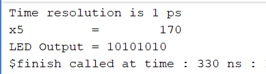

# Implement Memory-Mapped I/O Control

## Objective

To implement Memory-Mapped I/O (MMIO) in the RV32I 5-stage pipelined processor and control a GPIO device through a dedicated memory address.

---

## Introduction

Memory-Mapped I/O (MMIO) allows peripherals such as LEDs, UARTs, timers, and sensors to be accessed using normal memory instructions. Instead of using special I/O instructions, the processor communicates with peripherals through reserved memory locations.

In this experiment, address `0xF0` is assigned to a GPIO register. When the processor executes a store instruction to this address, the value is written to the GPIO register rather than normal data memory. The GPIO register then drives the LED output.

---

## Memory Map

| Address Range | Function |
|--------------|----------|
| 0 - 239 | Data Memory (RAM) |
| 240 (0xF0) | GPIO Register |
| 241 onwards | Reserved |

---

## MMIO Implementation

### GPIO Register

```verilog
reg [7:0] gpio_reg;
assign gpio_out = gpio_reg;
```

### MMIO Write Logic

```verilog
always @(posedge clk) begin

    if(memwrite) begin

        if(addr == 32'd240)
            gpio_reg <= write_data[7:0];

        else
            mem[addr] <= write_data;

    end

end
```

If the processor writes to address `240 (0xF0)`, the data is stored in the GPIO register. Otherwise, it is written to normal RAM.

---

## Test Program

### Assembly Code

```assembly
addi x5, x0, 170
sw   x5, 240(x0)
ecall
```

### Machine Code

```text
0AA00293
0E502823
00000073
```

---

## Program Execution

### Step 1

```assembly
addi x5, x0, 170
```

Stores:

```text
x5 = 170
```

Binary representation:

```text
170 = 10101010₂
```

### Step 2

```assembly
sw x5, 240(x0)
```

The processor generates address `240`.

The MMIO logic detects:

```text
addr = 240 (0xF0)
```

and updates:

```text
gpio_reg = 170
```

instead of writing to RAM.

### Step 3

```assembly
ecall
```

Terminates execution.

---

## Simulation Results

### Register Value

```text
x5 = 170
```

### LED Output

```text
LED Output = 10101010
```

### Waveform Observation

Initially, the LED output remains `0` because the instructions are still propagating through the 5-stage pipeline.

```text
IF → ID → EX → MEM → WB
```

After the store instruction reaches the Memory stage and accesses address `0xF0`, the GPIO register is updated and the LED output changes from:

```text
00000000
```

to

```text
10101010
```

The value then remains stable because the GPIO register retains its contents until another write operation occurs.

---

## Verification

The following were successfully verified:

- ADDI instruction execution
- Register x5 updated with 170
- Store instruction generated address 0xF0
- MMIO logic detected GPIO address
- GPIO register updated correctly
- LED output reflected GPIO value

Observed result:



---

## Difference Between GPIO Interface and MMIO

### GPIO Interface

```text
x5
 ↓
GPIO
 ↓
LED
```

The LED was directly connected to a processor-generated value.

### Memory-Mapped I/O

```text
x5
 ↓
SW Instruction
 ↓
Address 0xF0
 ↓
GPIO Register
 ↓
LED
```

The processor controls the peripheral through a dedicated memory address.

---

## Conclusion

Memory-Mapped I/O was successfully implemented in the RV32I 5-stage pipelined processor. A GPIO register was mapped to address `0xF0`, allowing the processor to control an external LED using a standard store instruction. Simulation results verified correct MMIO operation, demonstrating how peripherals are interfaced in real processor-based systems.
