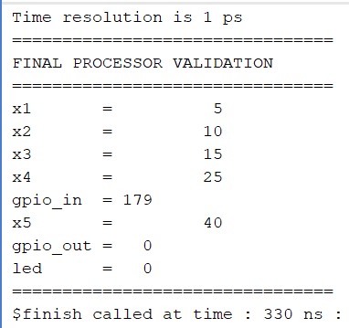
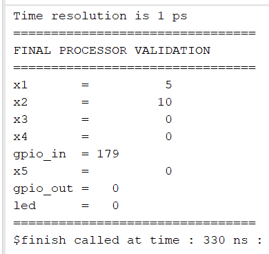

# Test and Debug Final RISC-V Processor Design

## Objective

To validate the functionality of the final RV32I 5-stage pipelined processor by executing representative test programs and verifying arithmetic operations, forwarding logic, hazard handling, and Memory-Mapped I/O (MMIO) functionality.

---

# Test 1: Arithmetic and Forwarding Validation

## Assembly Code

```assembly
addi x1,x0,5
addi x2,x0,10

add  x3,x1,x2
add  x4,x3,x2
add  x5,x4,x3

ecall
```

## Machine Code

```text
00500093
00A00113
002081B3
00218233
003202B3
00000073
```

## Expected Output

```text
x1 = 5
x2 = 10
x3 = 15
x4 = 25
x5 = 40
```

## Observed Output



## Verification

The result of each instruction was immediately consumed by the following instruction without inserting software stalls.

Example:

```assembly
add x3,x1,x2
add x4,x3,x2
```

The second instruction depends on the result of the first instruction. Correct outputs confirm that the forwarding unit successfully resolved data dependencies.

### Result

PASS

---

# Test 2: Load-Use Hazard Validation

## Objective

To verify the hazard detection unit for load-use dependencies.

## Data Memory Initialization

```text
mem[0] = 5
```

## Assembly Code

```assembly
lw  x1,0(x0)
add x2,x1,x1

ecall
```

## Machine Code

```text
00002083
00108133
00000073
```

## Expected Output

```text
x1 = 5
x2 = 10
```

## Observed Output



## Verification

This test introduces a load-use dependency.

```assembly
lw  x1,0(x0)
add x2,x1,x1
```

The ADD instruction immediately requires the value being loaded by the previous instruction. The hazard detection unit inserts a stall cycle to ensure correct execution.


### Result

PASS

---

# Test 3: MMIO Input and Output Validation

## Objective

To verify Memory-Mapped I/O communication between external peripherals and the processor.

---

## Memory Map

| Address | Function |
|----------|----------|
| 0xF0 | GPIO Output Register |
| 0xF1 | GPIO Input Register |

---

## Assembly Code

```assembly
lw   x5,241(x0)
addi x5,x5,1
sw   x5,240(x0)

ecall
```

---

## Machine Code

```text
0F102283
00128293
0E502823
00000073
```

---

## Testbench Input

```verilog
gpio_in = 8'b10110011;
```

Input value:

```text
179 decimal
```

---

## Expected Execution

```text
Read GPIO Input
      ↓

x5 = 179

Increment Value
      ↓

x5 = 180

Write to GPIO Output
      ↓

GPIO Output = 180
LED Output  = 180
```

---

## Observed Output


---

## Waveform Observation

```text
gpio_in  : 179
gpio_out : 0 → 179 → 180
led      : 0 → 179 → 180
```

Initially the output remains zero because instructions are still propagating through the pipeline stages.

```text
IF → ID → EX → MEM → WB
```

The first store operation writes the original GPIO input value to the output register.

```text
gpio_out : 0 → 179
```

The processor then increments the input value and performs another store operation.

```text
gpio_out : 179 → 180
```

This verifies:

- MMIO Input Read
- MMIO Output Write
- Processor Computation
- Peripheral Communication

### Result

PASS

---

# Final Validation Summary

| Test | Status |
|--------|--------|
| Arithmetic Operations | PASS |
| Data Forwarding | PASS |
| Load Hazard Handling | PASS |
| MMIO Input Read | PASS |
| MMIO Output Write | PASS |
| Processor Computation | PASS |
| ECALL Termination | PASS |

---

# Conclusion

The final RV32I 5-stage pipelined processor was successfully tested using arithmetic, forwarding, load-use hazard, and Memory-Mapped I/O validation programs. Simulation outputs and waveform analysis confirmed correct instruction execution, forwarding operation, hazard detection, register writeback, MMIO communication, and processor-to-peripheral interaction. All validation tests passed successfully.
